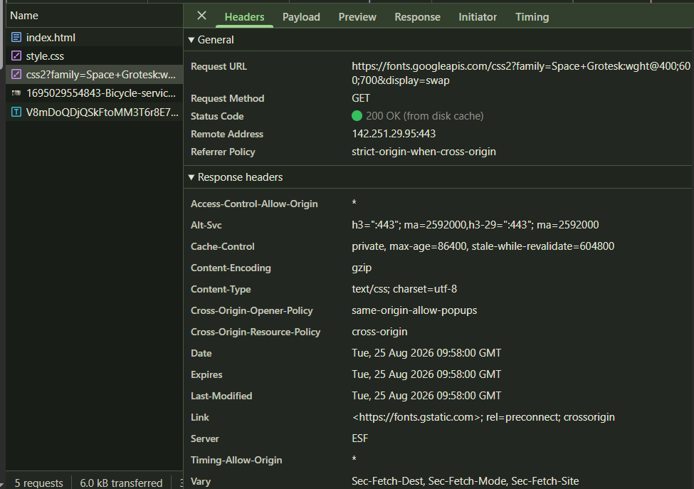
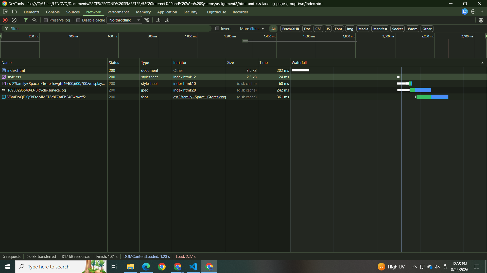
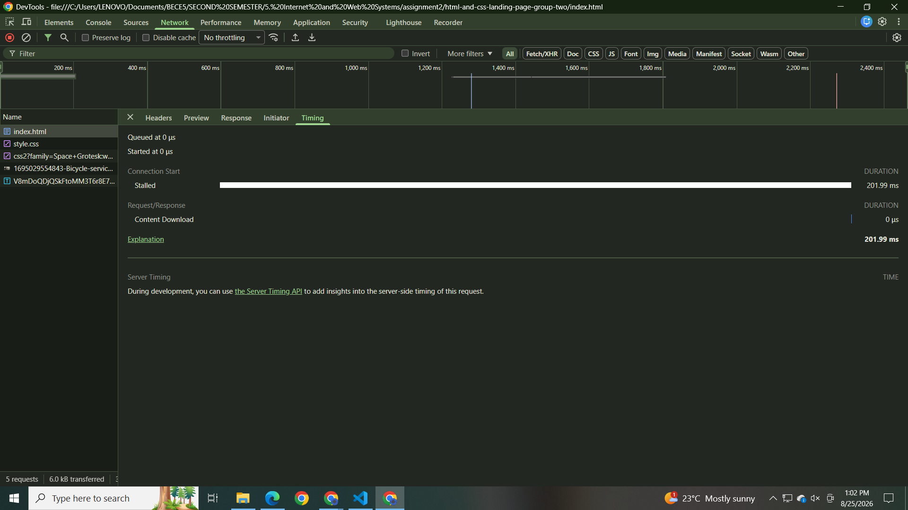
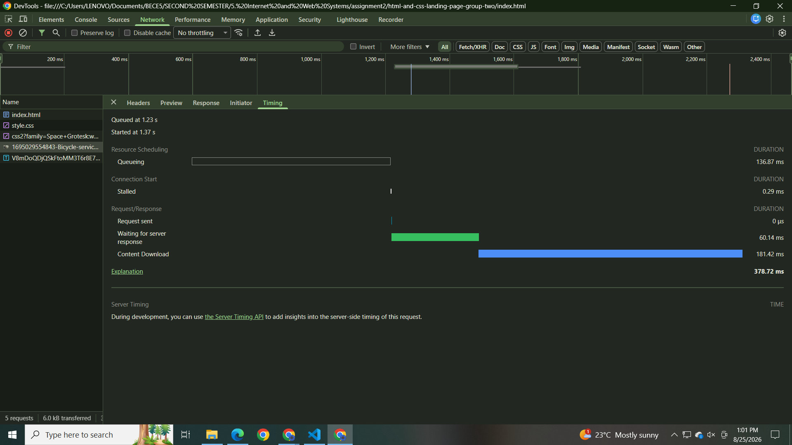
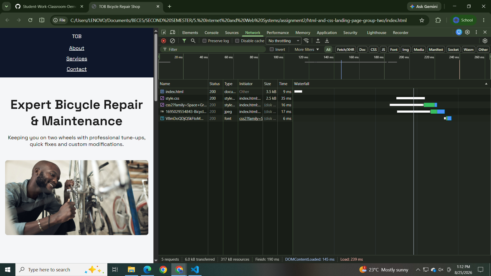

# Part C — Network & HTTP Investigation

## Q1: Google Font Request

**Status Code:** 200
**Content-Type:** text/css; charset=utf-8

## Q2: Render-Blocking CSS (4 marks)

**Screenshot:**

**Why does the browser delay showing visible content until the CSS request finishes?**

The waterfall shows `index.html` downloading first (202 ms), followed by `style.css`. Although `style.css` itself only takes 24 ms to download, the browser does not paint any visible content on the page until this CSS request resolves — this is why DOMContentLoaded doesn't fire until 1.28s, well after the CSS has been fetched and parsed. Since `<link rel="stylesheet">` is placed in `<head>`, it is treated as **render-blocking**: the browser intentionally pauses rendering to avoid briefly showing unstyled HTML before the CSS applies. The remaining resources — the Google Font CSS, the bicycle image, and the `.woff2` font file — appear later in the waterfall and are served from disk cache, since they are not required before the initial paint and are fetched as the browser continues parsing the rest of the page.

**What would happen if the `<link>` were moved to the end of `<body>` instead? Would you actually want to do that?**

If the `<link rel="stylesheet">` were moved to the end of `<body>`, the browser would no longer block rendering on it. Instead, it would parse and paint the HTML content first — showing raw, unstyled text and images (default browser styling only) — and only apply the CSS once that request finally loads at the bottom of the page. This would technically make the initial paint happen faster, since the browser wouldn't be waiting on `style.css` before showing anything.

However, this would create a visible **Flash of Unstyled Content (FOUC)**: the user would briefly see an ugly, unstyled version of the page before it suddenly "snaps" into its styled layout once the CSS arrives. For this project, that tradeoff isn't worth it — the CSS file is small and fast (24 ms), so the render-blocking delay it causes is negligible, while the visual flash from moving it would actively hurt user experience. Render-blocking `<link>` tags in `<head>` are the correct approach for critical page styling; deferring stylesheets to the end of `<body>` is generally reserved for non-critical CSS, not core layout/theme styles like this one.

## Q3: External Image vs. index.html Timing (3 marks)
**Date:** 08/25/2026
**Session:** 8:00pm - 9:00PM

**Screenshots:**

**Why does the external image typically take longer than the initial document, even if it's a smaller file?**

The `index.html` timing breakdown shows a normal request: 60.14 ms **Waiting for server response**, then 181.42 ms **Content Download**, totaling 378.72 ms.

The image's timing breakdown looks different: it shows 201.99 ms **Stalled** and 0 µs Content Download. This means the browser wasn't downloading the image at all during that time — it was held back because the browser only allows a limited number of connections at once, so the image had to wait its turn behind `index.html` and the other requests. Once it was allowed through, it loaded instantly from disk cache with no actual download needed.

So in this case, the image doesn't take longer because of network transfer — it takes longer because it gets queued and stalled while the browser is busy with earlier requests first.

## Q4: Cache Behavior on Reload (3 marks)

**Screenshot:**

**Did your font request's status code stay 200, or change to 304 (or serve from cache)?**

The font request shows **Status: 200**, but the Size column reads **(disk cache)** instead of a file size, and it loaded in just 6 ms.

**What does a 304 response mean, and why did it (or didn't it) happen for your font request?**

A 304 means the browser checked with the server and was told the file hadn't changed, so it reused the cached copy. That didn't happen here — instead of checking with the server, the browser skipped the network entirely and loaded the font straight from disk cache, which is why it shows 200 (disk cache) rather than 304.
